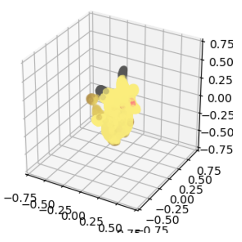
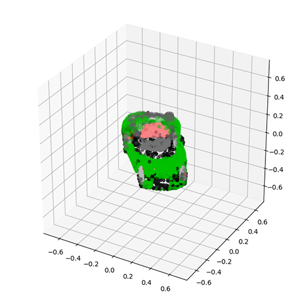
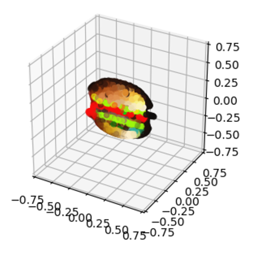
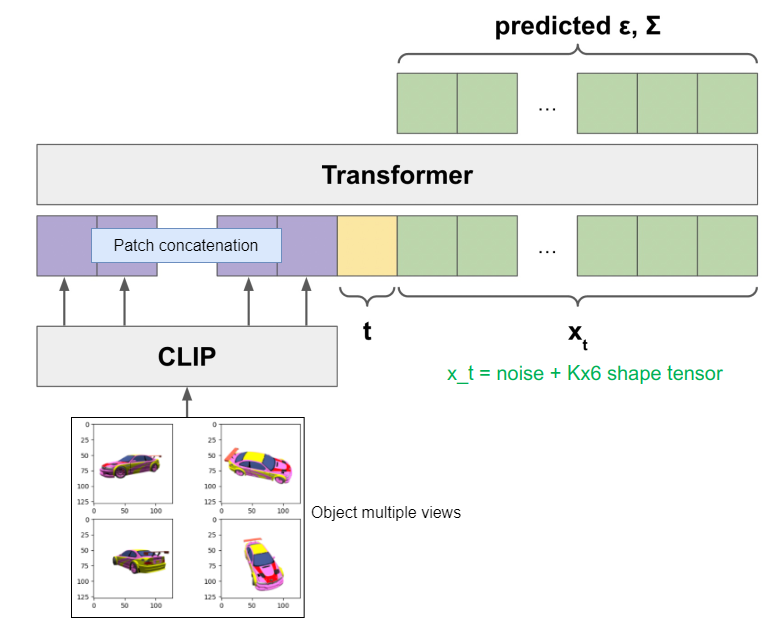
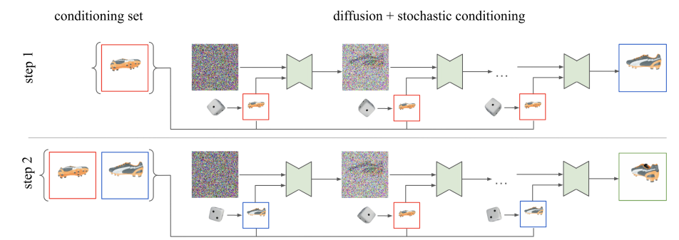
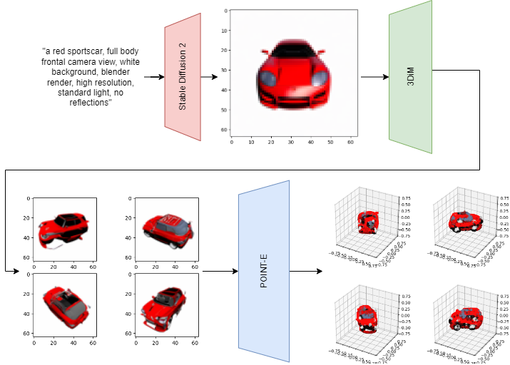

<table>
    <tr>
        <td></td>
        <td></td>
        <td></td>
    </tr>
</table>

# Stable, multi-view Point·E

In this repo we introduce multi-view conditioning for point-cloud diffusion, we test it in two pipelines: multiple synthetic views from text; multiple views from photos in the wild. We develop an evaluation dataset based on ShapeNet and ModelNet and propose a new metric to assess visually and analitically the overlap between two point clouds. This repo is based on the [official implementation of Point-E](https://github.com/openai/point-e).

Point-E is a [diffusion model](https://halixness.github.io/2023/intro-to-diffusion/): a generative model that approximates a data distribution through noising (forward process) and denoising (backward process). The backward process is also named "sampling", as you start from a noisy point in the distribution and convert it back to signal with some conditional information. In Point-E, we start from a random point cloud of 1024 points and denoise it with images (an object photo) as conditioning signal.

Compared to other techniques in literature, such as [Neural Radiance Fields](https://arxiv.org/abs/2003.08934), you can sample a point cloud with Point-E with a single gpu in 1-2 minutes. Sample quality is the price to pay, making this technique  ideal for task where point clouds are best suited.

## Table of contents

1. [Contributions](#contributions)
2. [Setup](#setup)
3. [Experiments](#experiments)
4. [Evaluation](#evaluation)
4. [Credits](#credits)


## Contributions

We extend conditioning for point cloud diffusion with multiple views. This tackles the problem of generating objects with duplicated faces, blurring in occluded parts and 3d consistency.    

### Multi-view with patch concatenation
Each conditioning image is encoded with the pre-trained [OpenAI CLIP](https://arxiv.org/abs/2103.00020), all the resulting embeddings are concatenated and fed as tokens into the denoising transformer. <br>
See: [`mv_point_e/models/transformer.py`](/mv_point_e/models/transformer.py)
<br>
<br>

<br>
<em>
    Original image: <a href="https://arxiv.org/abs/2212.08751">Nichol et al. 2022</a>
</em>
<br>
<br>

### Multi-view with stochastic conditioning
With inspiration from <a href="https://arxiv.org/abs/2210.04628">Watson et al. 2022</a>, a random conditioning image (from a given multi-view set) is fed to the denoising transformer at each diffusion denoising step.<br>
See: [`sc_point_e/models/transformer.py`](/sc_point_e/models/transformer.py)
<br>
<br>

<br>
<em>
    Original image: <a href="https://arxiv.org/abs/2210.04628">Watson et al. 2022</a>
</em>
<br>
<br>

### Multiple synthetic views with 3D-Diffusion 
We use 3D-Diffusion from [Watson et al. 2022](https://arxiv.org/abs/2210.04628) to generate 3d-consistent multiple views from a single, text-generated image (with stable diffusion 2). The current model is pre-trained on [SRNCars](#), a ShapeNet version will be released soon ([contribute here](https://github.com/halixness/distributed-3d-diffusion-pytorch)).
<br>
<br>

<br>
<br>

## Setup
There are two variants for multi-view:
- Patch concatenation: `mv_point_e`
- Stochastic conditioning: `sc_point_e`

You can either: 
1. Rename the folder of version you choose to `point_e` and run `pip install -e .` 
2. Without installing a global package, import from the specific variant in your code, e.g. for `sc_point_e`:
```
from sc_point_e.diffusion.configs import DIFFUSION_CONFIGS, diffusion_from_config
from sc_point_e.diffusion.sampler import PointCloudSampler
from sc_point_e.models.download import load_checkpoint
from sc_point_e.models.configs import MODEL_CONFIGS, model_from_config

from sc_point_e.evals.feature_extractor import PointNetClassifier, get_torch_devices
from sc_point_e.evals.fid_is import compute_statistics
from sc_point_e.evals.fid_is import compute_inception_score
from sc_point_e.util.plotting import plot_point_cloud
```

## Experiments

### Preprocessing
- [[1](notebooks/preprocessing/render_views_no_textures.ipynb)] Generating the textureless objects dataset (views, ground shapes).
- [[2](notebooks/preprocessing/render_views_textures.ipynb)] Generating the complete textured objects dataset (views, ground shapes).

### 3D Reconstruction
- [[1](notebooks/1_local_stable_point_e.ipynb)] Text-to-3d with Stable Diffusion 2 + Inpainting (single view)
- [[2](notebooks/2_local_srncars_multiview_point_e.ipynb)] Text-to-3d with multiple rendered views from the SRNCars Dataset (multi-view)
- [[3](3d-diffusion/3_local_stable3dim_multiview_point_e.ipynb)] Text-to-3d with multiple synthetic views from Stable Diffusion + [3D-Diffusion (Watson et al. 2022)](https://3d-diffusion.github.io)
- [[4](notebooks/4_local_photo_point_e.ipynb)] Text-to-3d from multiple photos "in the wild"

### Evaluation, metrics
- [[1](notebooks/evaluation/dataset_processing_results.ipynb)] Dataset pre-processing and scores computation
- [[2](notebooks/evaluation/metrics_evaluation_test.ipynb)] A digression on the chosen metrics with experiments
- [[3](notebooks/evaluation/multiviews_patch_concat.ipynb)] Evaluating text-to-3D from multi view (patch concat.)
- [[4](notebooks/evaluation/multiviews_methods_comparison.ipynb)] Comparing the chosen multi-view, text-to-3D methodologies
- [[5](notebooks/evaluation/occluded_objects_1.ipynb), [6](notebooks/evaluation/occluded_objects_2.ipynb)] Evaluating results on occluded object parts
- [[7](notebooks/evaluation/plot_results.ipynb)] Scores visualization and plotting

## Evaluation 
This dataset has been developed to assess the quality of the reconstructions from our multi-view models wrt. single-view Point-E.
Through experimentation, we generated several datasets from the 
available sources ModelNet40, ShapeNetV2, ShapeNetV0. 
Specifically, the datasets generated from ModelNet40, ShapeNetV0 are  textureless: we generated synthetic colouring through since RGB/grayscale values and sine functions.

### Getting Started & Installing

The complete set of data can be found at this [link](https://drive.google.com/drive/folders/1qPWA2J4e08tErD8720NlPISAiO3hGaEq?usp=share_link).


| Name                                | Samples | Source        |
|-------------------------------------|---------|---            |
| ModelNet40, textureless             | 40      | [Google Drive](https://drive.google.com/file/d/1cP1-fHiSm5eOG60m5WwU08U2Uz9eYp3L/view?usp=share_link)             |   
| ShapeNetv2, textureless             | 55      | [Google Drive](https://drive.google.com/file/d/1O-htsw9h2MKLpyVlog_672iMHp_VoBcf/view?usp=share_link)             |   
| Mixed, textureless                  | 190     | [Google Drive](https://drive.google.com/file/d/1YyRBEmpot2JsC2tfeqjwBV1WJh9YMTJT/view?usp=share_link)             | 
| Shapenet with textures              | 650     | [Google Drive](https://drive.google.com/file/d/1NS6oDLRMAAHfnvVmT69y6SucDgwllCiw/view?usp=share_link)             | 
| OpenAI seed imgs/clouds             | /       | [Google Drive](https://openaipublic.azureedge.net/main/point-e/banner_pcs.zip)             |   
| OpenAI, COCO CLIP R-Precision evals | /       | [Google Drive](https://openaipublic.azureedge.net/main/point-e/coco_images.zip)             |   

[Here](https://drive.google.com/file/d/1UOT9GfpiNfmVJPVrG2SnMwkpXic3g9iq/view?usp=share_link) you can find the generated clouds 
from the dataset ShapeNetv2 and ModelNet40 textureless 
comprehensive of the ground truth data, score and plot of the pairwise divergence distribution. More 
details are provided in the description.

### Description

Each sample in the dataset consists in a set of RGB, 256x256 `V` views and a cloud of `K` points sampled with PyTorch3D.
```
    view:   (N, V, 256, 256, 3)
    cloud:  (N, K, 3)
```
Further details on rendering:
+ The light of the scene is fixed
+ No reflections
+ Two versions of the dataset:
  + Fixed elevation and distance of the camera from the object, we 
  took 6 pictures rotating around the object
  + Fixed the distance of the camera from the object, we 
  took 6 pictures changing stochastically the value of the elevation
  of the camera and rotating around the object 
+ We iterate this procedure on 25 different objects for each class in ShapeNet
+ Each view is 256x256 

You can see the pipeline for the generation of the ShapeNet dataset with textures [here](/notebooks/preprocessing/render_views_no_textures.ipynb).

Concerning the set of views in the dataset produced from ShapeNetv2 and ModelNet40 textureless:
+ The light of the scene is fixed
+ No reflections
+ We fixed the elevation and the distance of the camera from the object and we 
took 4 pictures rotating around the object
+ We iterate this procedure on one object for each class in ShapeNetv2 and ModelNet40
+ Each view is 512x512

You can check the pipeline for the generation of the ShapeNetv2 and ModelNet40 textureless dataset [here](notebooks/preprocessing/render_views_textures.ipynb) 
with all the steps.

Here follows the directories [structure](https://drive.google.com/drive/folders/1qPWA2J4e08tErD8720NlPISAiO3hGaEq?usp=share_link): 
```
<directories>
    > shapenet_withTextures
        >> eval_clouds.pickle
        >> eval_views_fixed_elevation.pickle
        >> eval_views_stochastic_elevation.pickle       
    > modelnet40_texrand_texsin
        >> modelnet_csinrandn
            >>> CLASS_MAP.pt
            >>> images_obj.pt
            >>> labels.pt
            >>> points.pt
        >> modelnet_texsin
            >>> CLASS_MAP.pt
            >>> images_obj.pt
            >>> labels.pt
            >>> points.pt
    > shapenetv2_texrand_texsin
        >> shapenetv2_csinrandn
            >>> CLASS_MAP.pt
            >>> images_obj.pt
            >>> labels.pt
            >>> points.pt
        >> shapenetv2_texsin
            >>> CLASS_MAP.pt
            >>> images_obj.pt
            >>> labels.pt
            >>> points.pt
    > shapenetv2_modelnet40_texrand_texsin
        >> shapenet_modelnet_singleobject
            >>> modelnet_csinrandn
                >>>> CLASS_MAP.pt
                >>>> images_obj.pt
                >>>> labels.pt
                >>>> points.pt
            >>> modelnet_texsin
                >>>> CLASS_MAP.pt
                >>>> images_obj.pt
                >>>> labels.pt
                >>>> points.pt
            >>> shapenet_csinrandn
                >>>> CLASS_MAP.pt
                >>>> images_obj.pt
                >>>> labels.pt
                >>>> points.pt
            >>> shapenet_texsin
                >>>> CLASS_MAP.pt
                >>>> images_obj.pt
                >>>> labels.pt
                >>>> points.pt
    > dataset_shapenet_modelnet_texsin_withgeneratedcloud
        >> modelnet_texsin
            >>> CLASS_MAP.pt
            >>> eval_clouds_modelnet_300M.pickle
            >>> images_obj.pt
            >>> labels.pt
            >>> modelnet_gencloud_300M
            >>> points.pt
        >> shapenet_texsin
            >>> CLASS_MAP.pt
            >>> eval_clouds_shapenet_300M.pickle
            >>> images_obj.pt
            >>> labels.pt
            >>> shapenet_gencloud_300M
            >>> points.pt


```
### File specifications

    shapenet_withTextures

    - list of the sampled cloud: eval_clouds.pickle # (n_img, ch, n_points) ch: 6, n_points: 4096

    - list of gen views with fixed elevation: eval_views_fixed_elevation.pickle # (n_img, n_view, 256, 256, 3)

    - list of gen views with stochastic elevation: eval_views_stochastic_elevation.pickle # (n_img, n_view, 256, 256, 3)
    
    shapenetv2_modelnet40_texrand_texsin

    - dictionary with {index: 'typeOfObject'}: CLASS_MAP.pt 

    - multiple viwes for each object: images_obj.pt # (n_img, n_view, 512, 512, 3)

    - label for each object: labels.pt # (n_img,)

    - ground truth point cloud: points.pt # (n_img,)

    - tensor with the the generated pointcloud with point-e 300M: 
      ch: 6 (first 3 channel coord the others are the rgb colors of each point)
      n_points: 4096 (generated points)
                                                      modelnet_gencloud_300M # (n_img, ch, n_points)
                                                      shapenet_gencloud_300M # (n_img, ch, n_points)
    
    dataset_shapenet_modelnet_texsin_withgeneratedcloud

    - dictionaries: 
                eval_clouds_modelnet_300M.pickle
                eval_clouds_shapenet_300M.pickle

        dictionary['nameOfTheObject'][index]

                                      index 0: divergence_ground_single
                                      index 1: divergence_ground_single_distribution_plot
                                      index 2: divergence_ground_multi
                                      index 3: divergence_ground_multi_distribution_plot
                                      index 4: divergence_single_multi
                                      index 5: divergence_single_multi_distribution_plot
                                      index 6: ground_truth_pis
                                      index 7: single_view_pis
                                      index 8: multi_view_pis
                                      index 9: ground_truth_point_cloud
                                      index 10: single_view_point_cloud
                                      index 11: multi_view_point_cloud

        

### Dependencies

* import the files pt with torch
```
images_obj_views = torch.load(os.path.join(base_path,'images_obj.pt'))
```

* import the pickle file with the metrics or the shapenet_withTextures files
* more info in the [notebook1](https://github.com/r1cc4r2o/point-e/blob/main/notebooks/3_evaluateTheModels.ipynb) or [notebook2](https://github.com/r1cc4r2o/point-e/blob/main/notebooks/4_plotTheResults.ipynb).
```
dataset = 'shapenet'
base_path = os.path.join(dataset+"_texsin")
with open(os.path.join(base_path, 'eval_clouds_'+dataset+'_300M.pickle'), 'rb') as handle:
    data = pickle.load(handle)
```

### Possible improvements
- Extending the dataset ShapeNet PSR
- Increasing the view resolution 512x512 or 1024x1024 

### Authors
+ Diego Calanzone [@diegocalanzone](https://it.linkedin.com/in/diegocalanzone)
+ Riccardo Tedoldi [@riccardotedoldi](https://www.instagram.com/riccardotedoldi/)

### Version History
* 0.1
    * Initial Release
### License

Permission is hereby granted, free of charge, to any person obtaining a copy of this software and associated documentation files (the "Software"), to deal in the Software without restriction, including without limitation the rights to use, copy, modify, merge, publish, distribute, sublicense, and/or sell copies of the Software, and to permit persons to whom the Software is furnished to do so, subject to the following conditions:

The above copyright notice and this permission notice shall be included in all copies or substantial portions of the Software.

THE SOFTWARE IS PROVIDED "AS IS", WITHOUT WARRANTY OF ANY KIND, EXPRESS OR IMPLIED, INCLUDING BUT NOT LIMITED TO THE WARRANTIES OF MERCHANTABILITY, FITNESS FOR A PARTICULAR PURPOSE AND NONINFRINGEMENT. IN NO EVENT SHALL THE AUTHORS OR COPYRIGHT HOLDERS BE LIABLE FOR ANY CLAIM, DAMAGES OR OTHER LIABILITY, WHETHER IN AN ACTION OF CONTRACT, TORT OR OTHERWISE, ARISING FROM, OUT OF OR IN CONNECTION WITH THE SOFTWARE OR THE USE OR OTHER DEALINGS IN THE SOFTWARE.

### Acknowledgments

* Dataset [ModelNet40](http://modelnet.cs.princeton.edu/ModelNet40.zip)
* Dataset [ShapeNetCoreV2](https://shapenet.cs.stanford.edu/shapenet/obj-zip/ShapeNetCore.v2.zip)
* Dataset [ShapeNetCore](http://shapenet.cs.stanford.edu/shapenet/obj-zip/SHREC16/val.zip)
* [Shapenet](https://shapenet.org/)
* [Modelnet](https://modelnet.cs.princeton.edu/)
* Dataset [Shapenet_psr](https://s3.eu-central-1.amazonaws.com/avg-projects/shape_as_points/data/shapenet_psr.zip)

## Credits
- [a6o: 3d-diffusion implementation](https://github.com/a6o/3d-diffusion-pytorch)
- [OpenAI: official Point-E implementation](https://github.com/openai/point-e)
- [RemBG: background removal, U^2 Net implementation](https://github.com/danielgatis/rembg)

## Cite this work
```bibtex
@misc{CalanzoneTedoldi2022,
    title   = {Generating point clouds from multiple views with Point-E},
    author  = {Diego Calanzone, Riccardo Tedoldi, Zeno Sambugaro},
    year    = {2023},
    url  = {http://github.com/halixness/point-e}
}
```
